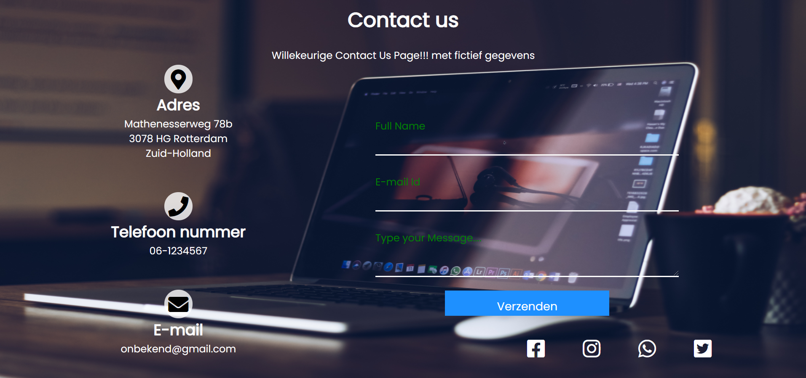

# Fictief "Contact us" page

## De applicatie starten
Als je het project gecloned hebt naar jouw locale machine, installeer je eerst de node_modules
door het volgende commando in de terminal te runnen:

`npm install`

Wanneer dit klaar is, kun je de applicatie starten met behulp van:

`npm start`

of gebruik de WebStorm knop (npm start). Open [http://localhost:3000](http://localhost:3000) om
de pagina in de browser te bekijken.
